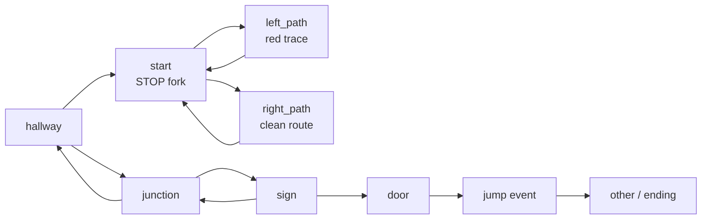
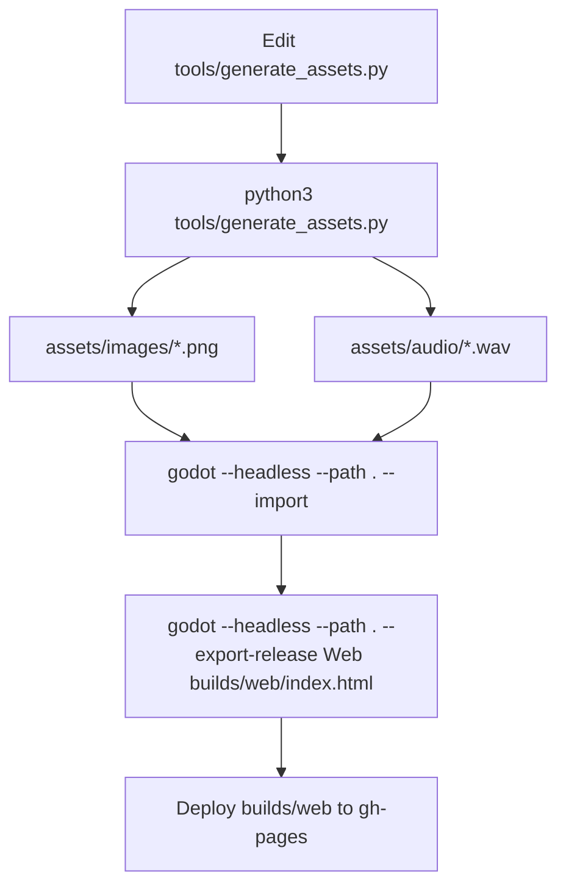

# CodeGraph

This document maps the current prototype so future edits can target the right file first.

## Runtime Graph

```mermaid
flowchart TD
    project["project.godot"] --> scene["scenes/main.tscn"]
    scene --> game["src/Game.gd"]

    game --> roomData["ROOM_DATA"]
    game --> nodes["_build_nodes()"]
    game --> assets["_load_assets()"]
    game --> input["_input()"]
    game --> frame["_process()"]

    assets --> render["_render_room()"]
    roomData --> render
    input --> click["_handle_click()"]
    click --> hotspot["_hotspot_at()"]
    hotspot --> goRoom["_go_to_room()"]
    hotspot --> event["_handle_event()"]
    hotspot --> jump["_trigger_jump()"]

    goRoom --> render
    goRoom --> peek["_show_stop_sign_creature_peek()"]
    event --> caption["_flash_caption()"]
    jump --> ending["_show_ending()"]

    generator["tools/generate_assets.py"] --> images["assets/images/*.png"]
    generator --> audio["assets/audio/*.wav"]
    images --> assets
    audio --> assets
```

## File Responsibilities

| File | Responsibility | Edit When |
| --- | --- | --- |
| `src/Game.gd` | Main game loop, room graph, hotspots, captions, creature timing, UI layers, audio playback. | Change flow, interactions, event text, creature behavior, ending. |
| `tools/generate_assets.py` | Generates blockout images, foreground STOP sign, overlays, placeholder audio. | Change visual placeholders or later batch-generate final room images. |
| `assets/images/*.png` | Generated or imported room images and overlays. | Replace with final visual pass after layout approval. |
| `assets/audio/*.wav` | Generated ambience and SFX placeholders. | Replace or tune audio pass. |
| `scenes/main.tscn` | Minimal scene root with `Game.gd` attached. | Only change if splitting UI into scene nodes. |
| `project.godot` | Godot app settings and web/export-relevant display config. | Change resolution, stretch, renderer, app metadata. |
| `export_presets.cfg` | Web export preset. | Change release/export target settings. |

## Hot Edit Map

Use this map before modifying code.

| Goal | Primary Location | Secondary Location |
| --- | --- | --- |
| Add/remove a room | `ROOM_DATA` in `src/Game.gd` | Add `scene_*()` and output key in `tools/generate_assets.py` |
| Change where a click works | `ROOM_DATA[room]["hotspots"]` | Matching visual shape in `tools/generate_assets.py` |
| Change room captions | `ROOM_DATA[room]["caption"]` | `_room_caption()` for dynamic captions |
| Change inspect text | `_handle_event()` and `_repeat_event_line()` | Hotspot `event` ids in `ROOM_DATA` |
| Change navigation triggers | `_go_to_room()` | `ROOM_DATA` hotspot targets |
| Change first creature peek timing | `_go_to_room()` timer and `_show_stop_sign_creature_peek()` | `paths_taken`, `creature_peek_seen` state |
| Change later creature proximity | `_advance_creature()` and `_update_creature()` | Current calls to `_advance_creature()` |
| Change final jump scare | `_trigger_jump()` | `door` room hotspot target |
| Change visual style globally | `tools/generate_assets.py` constants and drawing helpers | `assets/images/*.png` regeneration |
| Change final imported art | Replace `assets/images/*.png` | Keep filenames stable unless `ROOM_DATA` changes |

## Room Graph



Current issue: `hallway` is reachable only from `junction`, while `junction` is not reachable from the current `start -> left/right -> start` loop. Before adding art, confirm whether the intended route should expose `hallway`, `junction`, and `sign`.

## State Graph

| State | Variables | Meaning |
| --- | --- | --- |
| Current room | `room_id` | Key into `ROOM_DATA`. |
| Game mode | `game_state` | Currently mostly `play`, `jump`, `ending`; title layer is disabled by `_show_title()`. |
| Progress count | `move_count` | Room transitions, used for dynamic caption logic. |
| Creature proximity | `creature_stage` | Main creature visibility/proximity stage. Most automatic stage advancement is currently disabled. |
| First fork visit | `paths_taken` | Tracks whether left/right path has been entered from `start`. |
| STOP peek guard | `creature_peek_seen`, `creature_peek_active` | Ensures first STOP-sign creature peek runs once. |
| Event repeats | `clicked_events` | Prevents repeated inspect text from firing the first-time line again. |
| Door warning | `door_warning_seen` | First door click warns, second triggers jump scare. |

## Asset Pipeline



Rule for this phase: keep generated images as blockout placeholders until the user approves room flow and object placement. Final style should be applied as one coordinated pass, not room-by-room polishing.

## Refactor Targets

These are not required immediately, but they are the cleanest direction once the flow stabilizes.

1. Move `ROOM_DATA` into a separate data file or resource.
2. Add a dev-only hotspot overlay so click regions are visible during review.
3. Move creature timing into a data table instead of hard-coded timers.
4. Split rendering/UI setup from story state logic.
5. Add a small route validation script that catches unreachable rooms and missing image files.
