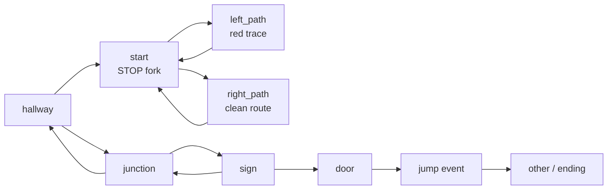
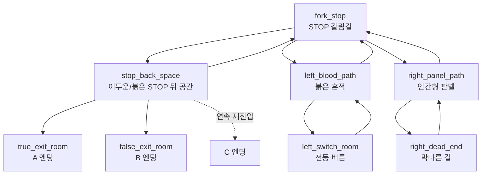
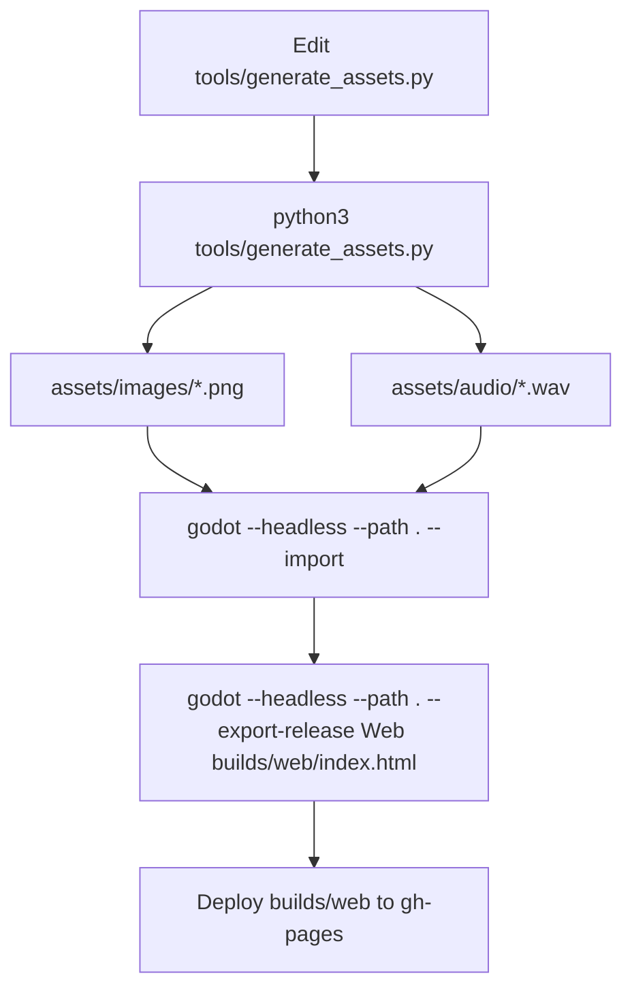

# CodeGraph

이 문서는 현재 프로토타입의 코드/데이터 연결 구조를 빠르게 파악하기 위한 지도다.

## Runtime Graph

```mermaid
flowchart TD
    project["project.godot"] --> scene["scenes/main.tscn"]
    scene --> game["src/Game.gd"]

    game --> roomData["ROOM_DATA"]
    game --> nodes["_build_nodes()"]
    game --> assets["_load_assets()"]
    game --> input["_input()"]
    game --> frame["_process()"]

    assets --> render["_render_room()"]
    roomData --> render
    input --> click["_handle_click()"]
    click --> hotspot["_hotspot_at()"]
    hotspot --> goRoom["_go_to_room()"]
    hotspot --> event["_handle_event()"]
    hotspot --> jump["_trigger_jump()"]

    goRoom --> render
    goRoom --> peek["_show_stop_sign_creature_peek()"]
    event --> caption["_flash_caption()"]
    jump --> ending["_show_ending()"]

    requirements["docs/DEV_REQUIREMENTS.md"] --> roomData
    requirements --> validation["planned route validation"]
    generator["tools/generate_assets.py"] --> images["assets/images/*.png"]
    generator --> audio["assets/audio/*.wav"]
    images --> assets
    audio --> assets
```

## 파일 역할

| 파일 | 역할 | 수정할 때 |
| --- | --- | --- |
| `src/Game.gd` | 게임 루프, 방 그래프, 핫스팟, 캡션, 크리처 타이밍, UI 레이어, 오디오 재생. | 진행 흐름, 상호작용, 문구, 크리처, 엔딩 수정. |
| `docs/DEV_REQUIREMENTS.md` | GDD 승인 후 route graph, hotspot, state flag, event/ending 조건을 구현 기준으로 고정. | 구현 전에 방/상태/엔딩 조건을 바꿀 때. |
| `tools/generate_assets.py` | 블록아웃 이미지, STOP 표지 전경, 오버레이, 임시 오디오 생성. | 블록아웃 배치 변경 또는 최종 배경 일괄 생성. |
| `assets/images/*.png` | 생성/교체되는 방 이미지와 오버레이. | 레이아웃 승인 뒤 최종 비주얼 패스 적용. |
| `assets/audio/*.wav` | 임시 앰비언스와 효과음. | 사운드 패스에서 교체 또는 튜닝. |
| `scenes/main.tscn` | `Game.gd`가 붙은 최소 루트 씬. | UI를 씬 노드로 분리할 때만 수정. |
| `project.godot` | 앱 설정, 해상도, 스트레치, 렌더러, 아이콘. | 프로젝트 설정 변경. |
| `export_presets.cfg` | Web export 프리셋. | 배포/export 설정 변경. |

## Hot Edit Map

수정 전 이 표에서 먼저 수정 위치를 잡는다.

| 목표 | 1차 수정 위치 | 같이 확인할 위치 |
| --- | --- | --- |
| 방 추가/삭제 | `src/Game.gd`의 `ROOM_DATA` | `tools/generate_assets.py`의 `scene_*()`와 출력 키 |
| 클릭 영역 변경 | `ROOM_DATA[room]["hotspots"]` | 해당 배경의 시각 도형 |
| GDD v2 route 변경 | `docs/DEV_REQUIREMENTS.md` | `src/Game.gd`의 `ROOM_DATA`, route validation |
| 방 캡션 변경 | `ROOM_DATA[room]["caption"]` | 동적 캡션은 `_room_caption()` |
| 조사 문구 변경 | `_handle_event()`, `_repeat_event_line()` | `ROOM_DATA`의 `event` id |
| 방 이동 조건 변경 | `_go_to_room()` | `ROOM_DATA`의 hotspot target |
| 첫 크리처 등장 타이밍 변경 | `_go_to_room()`의 timer, `_show_stop_sign_creature_peek()` | `paths_taken`, `creature_peek_seen` |
| 이후 크리처 접근감 변경 | `_advance_creature()`, `_update_creature()` | `_advance_creature()` 호출 위치 |
| 최종 점프스케어 변경 | `_trigger_jump()` | `door` 방 hotspot target |
| 전체 시각 스타일 변경 | `tools/generate_assets.py`의 상수/그리기 함수 | `assets/images/*.png` 재생성 |
| 최종 이미지 교체 | `assets/images/*.png` 파일 교체 | 파일명을 유지하면 `ROOM_DATA` 수정 불필요 |

## Current Room Graph



현재 확인할 점: `hallway`는 `junction`에서만 접근 가능하고, `junction`은 현재 `start -> left/right -> start` 루프에서 접근되지 않는다. 최종 아트를 넣기 전에 `hallway`, `junction`, `sign`이 실제 플레이 루트에 들어갈지 먼저 확정해야 한다.

## Target Room Graph

GDD v2 승인 후 구현 목표 그래프다. 상세 조건은 `docs/DEV_REQUIREMENTS.md`가 기준이다.



## State Graph

| 상태 | 변수 | 의미 |
| --- | --- | --- |
| 현재 방 | `room_id` | `ROOM_DATA`의 키. |
| 게임 모드 | `game_state` | 현재는 주로 `play`, `jump`, `ending`. title 레이어는 `_show_title()`에서 숨김. |
| 진행 횟수 | `move_count` | 방 이동 횟수. 동적 캡션에 사용. |
| 크리처 접근 단계 | `creature_stage` | 크리처 표시/접근감 단계. 현재 자동 증가 대부분 비활성. |
| 첫 갈림길 방문 | `paths_taken` | `start`에서 left/right에 들어갔는지 기록. |
| STOP 등장 가드 | `creature_peek_seen`, `creature_peek_active` | STOP 표지 뒤 첫 등장 1회 제한. |
| 조사 반복 | `clicked_events` | 같은 조사 이벤트 반복 시 다른 문구 출력. |
| 문 경고 | `door_warning_seen` | 첫 문 클릭은 경고, 두 번째는 점프스케어. |

v2에서 추가/교체할 상태:

| 상태 | 변수 | 의미 |
| --- | --- | --- |
| STOP 뒤 연속 재진입 | `stop_back_reentry_armed` | `fork_stop -> stop_back_space -> fork_stop -> stop_back_space` C 엔딩 판정. |
| 좌측 버튼 | `light_switch_pressed` | STOP 뒤 공간을 붉은 상태로 바꿈. |
| 붉은 STOP 뒤 확인 | `stop_back_red_seen` | A/B 출구 판정에 사용. |
| 붉은 흔적 단서 | `blood_trace_clicked` | A 엔딩 필수 단서. |
| 인간형 판넬 단서 | `panel_clue_clicked` | A 엔딩 필수 단서. |
| 우측 막다른 길 방문 | `right_dead_end_seen` | 복귀 판넬 소리와 크리처 1초 등장 조건. |
| 판넬 소리 1회 제한 | `panel_sound_played` | 우측 복귀 사운드 중복 방지. |
| 엔딩 분기 | `ending_id` | A/B/C 결과 표시. |

## Asset Pipeline



현재 원칙: 방 흐름과 오브젝트 위치가 승인되기 전까지 이미지는 블록아웃으로 유지한다. 최종 스타일은 방별로 따로 다듬지 말고 한 번에 적용한다.

## 리팩터링 후보

흐름이 안정된 뒤 적용하면 수정 효율이 올라가는 항목이다.

1. `ROOM_DATA`를 별도 데이터 파일 또는 Godot `Resource`로 분리.
2. 클릭 영역을 화면에 보여주는 개발용 hotspot overlay 추가.
3. 크리처 타이밍을 하드코딩 timer 대신 데이터 테이블로 분리.
4. 렌더링/UI 생성과 스토리 상태 로직 분리.
5. 도달 불가능한 방, 누락 이미지, 잘못된 target을 잡는 route validation 스크립트 추가.
