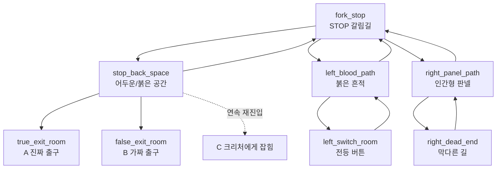

# Development Requirements: Backroom Level 0 v2.2

상태: GDD v2 승인 후 구현 기준, v2.2 결정 반영
목적: 구현 전에 route graph, hotspot, state flag, event/ending 조건을 고정한다.

## 1. Scope

이번 구현 목표는 최종 이미지가 아니라 플레이 가능한 v2 블록아웃이다.

포함:

- GDD v2의 8개 방 구조.
- STOP 뒤 공간의 어두운 상태, 붉은 상태, 연속 재진입 C 엔딩.
- 좌측 전등 버튼과 상태 변화.
- 우측 인간형 판넬 단서, 막다른 길, 복귀 시 판넬 소리와 STOP 뒤 크리처 1초 등장.
- A/B/C 엔딩 조건.
- B 엔딩 전 길목 차단 transition frame.
- 개발용 hotspot overlay와 route validation.
- Godot headless A/B/C route QA.

제외:

- 최종 실사풍 배경 이미지.
- 실시간 추적 AI.
- 최종 사진 기반 크리처 누끼 작업.

## 2. Room IDs

기존 `start`, `left_path`, `right_path` 중심 구조는 v2에서 아래 ID로 교체한다.

| # | Room ID | 역할 | 이미지 키 |
| ---: | --- | --- | --- |
| 1 | `fork_stop` | 시작 갈림길 | `bg_fork_stop.png` |
| 2 | `stop_back_space` | STOP 뒤 공간 | `bg_stop_back_dark.png`, `bg_stop_back_red.png` |
| 3 | `left_blood_path` | 붉은 흔적 길 | `bg_left_blood_path.png` |
| 4 | `left_switch_room` | 전등 버튼 방 | `bg_left_switch_room.png` |
| 5 | `right_panel_path` | 인간형 판넬 길 | `bg_right_panel_path.png` |
| 6 | `right_dead_end` | 막다른 길 | `bg_right_dead_end.png` |
| 7 | `true_exit_room` | A 엔딩 방 | `bg_true_exit_room.png` |
| 8 | `false_exit_room` | B 엔딩 방: STOP 표지판만 가득한 시작점 변형 | `bg_false_exit_room.png` |

엔딩 C는 별도 방이 아니라 즉시 결과 상태로 처리한다.
`bg_blocked_passage.png`는 별도 방이 아니라 B 엔딩 직전 전환 이미지로만 사용한다.

## 3. Target Route Graph

## 4. State Flags

| Flag | 초기값 | 변경 조건 | 사용처 |
| --- | --- | --- | --- |
| `stop_back_seen_once` | `false` | `stop_back_space` 첫 진입 | 최초 진입/반복 진입 구분 |
| `stop_back_reentry_armed` | `false` | `stop_back_space -> fork_stop` 이동 시 `true`, `fork_stop -> left/right` 이동 시 `false` | 연속 재진입 C 엔딩 |
| `light_switch_pressed` | `false` | `left_switch_room` 버튼 클릭 | STOP 뒤 공간 붉은 상태 |
| `stop_back_red_seen` | `false` | 버튼 작동 후 `stop_back_space` 진입 | A/B 출구 판정 |
| `blood_trace_clicked` | `false` | `left_blood_path` 붉은 흔적 클릭 | A 엔딩 필수 단서 |
| `panel_clue_clicked` | `false` | `right_panel_path` 인간형 판넬 클릭 | 우측 루트 위화감/크리처 노출 단서. A 필수 조건에서는 제외. |
| `right_dead_end_seen` | `false` | `right_dead_end` 진입 | 복귀 시 판넬 소리 조건 |
| `right_door_warning_seen` | `false` | `right_dead_end` 오른쪽 문 첫 클릭 | 문 재클릭 시 B 전환 |
| `right_note_available` | `false` | 문 경고 후 `right_panel_path` 복귀 | 쪽지 단서 표시 |
| `right_note_read` | `false` | 쪽지 화면 바깥 클릭 | A 엔딩 힌트 확인 완료 |
| `panel_sound_played` | `false` | `right_dead_end -> right_panel_path` 복귀 후 1회 | 우측 루트 위화감 |
| `creature_peek_seen` | `false` | 우측 루트 후 `fork_stop` 복귀 시 1회 | STOP 뒤 크리처 1초 등장 제한 |
| `ending_id` | `""` | 엔딩 진입 시 `A`, `B`, `C` | 결과 화면/엔딩 버튼 |

연속 재진입 판정:

1. `fork_stop -> stop_back_space`: `stop_back_reentry_armed`가 `true`면 즉시 C 엔딩.
2. `stop_back_space -> fork_stop`: `stop_back_reentry_armed = true`.
3. `fork_stop -> left_blood_path` 또는 `fork_stop -> right_panel_path`: `stop_back_reentry_armed = false`.
4. STOP 표지 조사처럼 방 이동이 아닌 행동은 `stop_back_reentry_armed`를 해제하지 않는다.

## 5. Hotspot Requirements

좌표는 현재처럼 정규화된 `Rect2(x, y, w, h)`를 사용한다. 아래 값은 블록아웃 1차 기준이며, 구현 후 overlay로 조정한다.

### `fork_stop`

| ID | Rect | Action | Prompt |
| --- | --- | --- | --- |
| `stop_sign` | `(0.420, 0.155, 0.160, 0.280)` | event `stop_sign` | `STOP` |
| `stop_back` | `(0.375, 0.010, 0.250, 0.135)` | target `stop_back_space` | `뒤쪽` |
| `left_path` | `(0.030, 0.235, 0.365, 0.655)` | target `left_blood_path` | `왼쪽 길` |
| `right_path` | `(0.605, 0.235, 0.365, 0.655)` | target `right_panel_path` | `오른쪽 길` |

### `stop_back_space`

| ID | Rect | Action | Prompt |
| --- | --- | --- | --- |
| `back_to_fork` | `(0.300, 0.835, 0.400, 0.130)` | target `fork_stop` | `돌아가기` |
| `red_exit_gap` | `(0.365, 0.255, 0.270, 0.470)` | event `attempt_exit` | `빛` |

`red_exit_gap`은 `light_switch_pressed == true`일 때만 활성화한다.

### `left_blood_path`

| ID | Rect | Action | Prompt |
| --- | --- | --- | --- |
| `blood_trace` | `(0.210, 0.595, 0.560, 0.190)` | event `blood_trace` | `흔적` |
| `forward_switch` | `(0.300, 0.480, 0.200, 0.115)` | target `left_switch_room` | `더 안쪽` |
| `back_to_fork` | `(0.300, 0.835, 0.400, 0.130)` | target `fork_stop` | `돌아가기` |

### `left_switch_room`

| ID | Rect | Action | Prompt |
| --- | --- | --- | --- |
| `light_switch` | `(0.430, 0.325, 0.170, 0.230)` | event `light_switch` | `버튼` |
| `back_left_path` | `(0.300, 0.835, 0.400, 0.130)` | target `left_blood_path` | `돌아가기` |

### `right_panel_path`

| ID | Rect | Action | Prompt |
| --- | --- | --- | --- |
| `human_panel` | `(0.405, 0.205, 0.220, 0.520)` | event `human_panel` | `판넬` |
| `floor_note` | `(0.320, 0.735, 0.220, 0.095)` | event `floor_note`, requires `right_note_available`, hidden when `right_note_read` | `쪽지` |
| `forward_dead_end` | `(0.660, 0.180, 0.300, 0.680)` | target `right_dead_end` | `앞으로` |
| `back_to_fork` | `(0.300, 0.835, 0.360, 0.130)` | target `fork_stop` | `돌아가기` |

### `right_dead_end`

| ID | Rect | Action | Prompt |
| --- | --- | --- | --- |
| `dead_wall` | `(0.335, 0.210, 0.330, 0.500)` | event `dead_wall` | `벽` |
| `back_panel_path` | `(0.300, 0.835, 0.400, 0.130)` | target `right_panel_path` | `돌아가기` |
| `blocked_right_door` | `(0.780, 0.160, 0.200, 0.700)` | event `right_door`; first click warns, second click `blocked_passage` | `문` |

### Ending Rooms

`true_exit_room`과 `false_exit_room`은 결과 표시 후 엔딩 UI 버튼을 띄운다. `재시작`은 로비 화면으로 돌아가고, `종료`는 종료 상태 화면으로 전환한다. 추가 room hotspot은 두지 않는다.

## 6. Event Rules

| Event | 조건 | 결과 |
| --- | --- | --- |
| `stop_sign` | 항상 | 짧은 조사 캡션. |
| `blood_trace` | 첫 클릭 | `blood_trace_clicked = true`, 단서 캡션. |
| `light_switch` | 첫 클릭 | `light_switch_pressed = true`, 버튼 눌림 연출, 캡션 "무언가 변한 것 같다". |
| `human_panel` | 첫 클릭 | `panel_clue_clicked = true`, 단서 캡션. |
| `right_door` | 첫 클릭 | `right_door_warning_seen = true`, 캡션 "뒤쪽에서 소리가 났다." |
| `right_door` | `right_door_warning_seen == true` | `blocked_passage` 전환 후 B 엔딩. |
| `floor_note` | `right_note_available == true` | 쪽지 화면 표시. 쪽지 화면 바깥 클릭 시 `right_note_read = true`, 0.5초 `note_flash` 이미지 표시. |
| `dead_wall` | 항상 | 막다른 길 캡션. |
| `attempt_exit` | `light_switch_pressed == true` | A/B 조건 판정. |

반복 클릭은 같은 정보를 길게 설명하지 말고 짧은 반복 캡션으로 처리한다.

## 7. Entry And Transition Rules

| Trigger | 조건 | 결과 |
| --- | --- | --- |
| Enter `stop_back_space` | `stop_back_reentry_armed == true` | 즉시 C 엔딩. |
| Enter `stop_back_space` | `light_switch_pressed == false` | 어두운 방 이미지/캡션. |
| Enter `stop_back_space` | `light_switch_pressed == true` | 붉은 방 이미지/캡션, `stop_back_red_seen = true`. |
| Leave `stop_back_space` to `fork_stop` | 항상 | `stop_back_reentry_armed = true`, 경고음을 1회 재생. |
| Leave `fork_stop` to left/right | 항상 | `stop_back_reentry_armed = false`. |
| Enter `right_dead_end` | 항상 | `right_dead_end_seen = true`. |
| Return `right_dead_end -> right_panel_path` | `panel_sound_played == false` | 판넬 소리, 캡션, `panel_sound_played = true`. |
| Return `right_panel_path -> fork_stop` | `right_dead_end_seen == true && creature_peek_seen == false` | STOP 뒤 크리처 1초 등장. |

## 8. Ending Conditions

| Ending | 조건 | 처리 |
| --- | --- | --- |
| A 진짜 출구 | `attempt_exit` 시 `light_switch_pressed && stop_back_red_seen && blood_trace_clicked` | `true_exit_room` 진입. 진짜 출구는 정면의 일반 문. |
| B 탈출 후 백룸 | `attempt_exit` 시 A 조건 중 하나라도 부족 | 추격 beat 후 `false_exit_room` 진입. 방은 시작점처럼 보이지만 STOP 표지판만 가득하고 바닥 문이 있다. |
| C 크리처에게 잡힘 | STOP 뒤 공간 연속 재진입 | 즉시 C 엔딩. |

B 엔딩의 v2.2 연출:

- `false_exit_room` 진입 직전에 `bg_blocked_passage.png`를 0.62초 보여주며 길목이 막힌 감각을 준다.
- 이후 소리/흔들림/크리처 실루엣으로 "쫓겨 들어갔다"는 감각을 준다.
- 엔딩 방에서 설명 캡션은 쓰지 않는다.
- 추후 승인 후 바닥 문 연출과 추격 컷을 강화한다.

## 9. Caption Draft

| 상황 | 문구 |
| --- | --- |
| 첫 갈림길 | `표지판 뒤가 비어 있다.` |
| STOP 표지 조사 | `글자가 칠해진 게 아니라 파여 있다.` |
| STOP 뒤 어두운 방 | `아무것도 보이지 않는다.` |
| STOP 뒤 붉은 방 | `불길하다.` |
| 붉은 흔적 조사 | `자국은 왼쪽에서 끊겨있다.` |
| 전등 버튼 | `무언가 변한 것 같다.` |
| 인간형 판넬 조사 | `이런 곳에 어째서?` |
| 막다른 길 | `길이 끊겼다.` |
| 판넬 복귀 소리 | `판넬 뒤에서 소리가 났다.` |
| 크리처 1초 등장 | `방금 표지판 뒤에 무언가 있었다.` |
| C | `돌아보면 안 됐다.` |

## 10. Implementation Order

1. 완료: `data/rooms.json`으로 v2 방 ID와 hotspot을 분리한다.
2. 완료: 상태 flag와 transition helper를 추가한다.
3. 완료: `stop_back_space`의 어두운/붉은 이미지 전환을 구현한다.
4. 완료: 이벤트 핸들러에 `blood_trace`, `light_switch`, `human_panel`, `attempt_exit`를 추가한다.
5. 완료: A/B/C 엔딩 함수를 분리한다.
6. 완료: 우측 루트 복귀 소리와 STOP 뒤 1초 크리처 beat를 구현한다.
7. 완료: 개발용 hotspot overlay를 추가한다.
8. 완료: route validation 스크립트로 누락 target, 누락 이미지, 도달 불가능 방을 검사한다.
9. 완료: 블록아웃 asset generator를 8개 방 기준으로 갱신한다.
10. 완료: B 엔딩 전 길목 차단 transition frame을 추가한다.
11. 진행: Godot Web export 후 배포 링크로 리뷰한다.

## 11. Acceptance Criteria

구현 완료 판정:

- 새 게임 시작 시 `fork_stop`에서 바로 플레이가 시작된다.
- 첫 `fork_stop -> stop_back_space`는 어두운 방만 보여준다.
- `fork_stop -> stop_back_space -> fork_stop -> stop_back_space`는 C 엔딩으로 간다.
- 좌측 버튼 클릭 후 `stop_back_space`가 붉은 상태로 보인다.
- 우측 막다른 길에서 돌아오면 판넬 소리가 1회만 난다.
- 우측 루트 후 `fork_stop` 복귀 시 크리처가 STOP 뒤에 1초만 나타난다.
- `blood_trace`, `human_panel`, `light_switch`가 클릭 가능한 단서/트리거로 작동한다.
- 필요한 단서를 모두 얻은 뒤 붉은 STOP 뒤 공간에서 출구를 누르면 A 엔딩이다.
- 단서가 부족한 상태에서 같은 출구를 누르면 B 엔딩이다.
- B 엔딩 전 `blocked_passage` transition frame이 나온 뒤 크리처 추격 beat가 이어져야 한다.
- `right_dead_end`에서 오른쪽 문을 누르면 `blocked_passage` transition frame이 나온 뒤 B 엔딩으로 이어진다.
- A 엔딩은 판넬 클릭 없이도 가능해야 한다.
- B 엔딩 방은 상호작용 없는 STOP 표지판 방이어야 한다.
- 게임 최초 진입은 로비 화면에서 시작하며 `시작` 버튼을 눌러 `fork_stop`에 들어간다.
- 플레이 중 클릭 가능한 hotspot 위에 마우스를 올리면 손 모양 커서, hover badge, 약한 영역 하이라이트가 보여야 한다.
- 엔딩 화면에는 `재시작`과 `종료` 버튼이 있어야 한다.
- debug overlay로 각 hotspot을 화면에서 확인할 수 있다.
- route validation에서 누락 target/image와 도달 불가능 방이 없어야 한다.
- Godot headless QA에서 A/B/C 루트가 모두 통과해야 한다.
