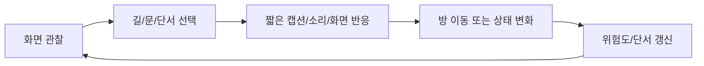

# GDD: Backroom Level 0 Prototype

상태: 승인 전 초안  
목적: 구현 전에 플레이 감정, 루트, 실패 조건, 상호작용 범위를 고정한다.

## 1. High Concept

플레이어는 백룸처럼 반복되는 공간에서 불안한 길찾기를 하며 진짜 출구를 찾아야 한다. 잘못된 선택이나 트리거 작동은 가짜 탈출 또는 크리처 사망 엔딩으로 이어진다.

## 2. Design Pillars

1. 불안한 길찾기
   - 즉각적인 점프스케어보다 "이 길이 맞나?"라는 판단 불안을 우선한다.
2. 공정한 클릭
   - 문, 길, 단서 몇 개만 클릭 가능하게 두고 판정은 넉넉하게 준다.
3. 짧고 명확한 플레이
   - 전체 플레이는 2분 이내를 목표로 한다.
4. 블록아웃 우선
   - 방 흐름과 오브젝트 위치가 승인되기 전에는 최종 이미지 작업을 하지 않는다.
5. 위험 신호 읽기
   - 빨간 흔적, STOP 뒤 공간, 인간 모양 판넬 같은 요소가 선택의 위험도를 암시한다.

## 3. Player Goal

주 목표: 진짜 출구를 찾아 탈출한다.

실패 또는 변형 결과:

- 잘못된 트리거 작동: 탈출한 듯 보이지만 다시 백룸.
- 잘못된 선택 또는 위험 진입: 크리처에게 잡힘.

## 4. Target Experience

핵심 감정: 불안한 길찾기.

플레이어가 느껴야 할 흐름:

1. 어디로 가야 할지 명확하지 않다.
2. 더 위험해 보이는 길에 오히려 단서가 있다.
3. 안전해 보이는 길은 막다른 길이고, 되돌아오는 과정에서 이상 현상이 생긴다.
4. STOP 뒤의 어두운 공간은 들어가면 안 되는 곳처럼 보인다.
5. 진짜 출구와 가짜 출구를 구분해야 한다.

## 5. Scope

| 항목 | 결정 |
| --- | --- |
| 장르 | 플래시 게임식 클릭/터치 어드벤처 |
| 테마 | 백룸 |
| 플레이 타임 | 2분 이내 |
| 방 개수 | 8개 |
| 엔딩 수 | 3개 |
| 텍스트 | 한국어 짧은 캡션 |
| 상호작용 밀도 | 문/길/단서 몇 개만 |
| 비주얼 단계 | 현재는 블록아웃, 최종 이미지는 일괄 적용 |

## 6. Endings

| ID | 엔딩 | 조건 방향 |
| --- | --- | --- |
| A | 진짜 출구 탈출 | 위험한 단서를 제대로 해석하고 올바른 출구 루트 선택. |
| B | 탈출 후 다시 백룸 | 잘못된 트리거 또는 가짜 출구 선택. |
| C | 크리처에게 잡힘 | STOP 뒤 공간 진입 등 강한 위험 선택. |

## 7. Core Loop

## 8. Interaction Rules

1. 클릭 대상은 문, 길, 단서로 제한한다.
2. 클릭 가능한 영역은 실제 시각 요소보다 약간 넓게 잡는다.
3. 막다른 길도 피드백을 준다.
4. 위험한 선택은 사전에 시각 신호를 둔다.
5. 단서는 반드시 캡션, 소리, 화면 변화 중 하나로 보상한다.
6. 최종 이미지 적용 전에는 hotspot debug overlay로 클릭 판정을 검토한다.

## 9. Room Plan

방 개수는 8개로 잡는다. 아래는 현재 답변을 바탕으로 한 초안이며, 다음 단계에서 실제 route graph로 확정한다.

| # | Room ID 제안 | 역할 | 핵심 요소 |
| ---: | --- | --- | --- |
| 1 | `fork_stop` | 시작 갈림길 | STOP 표지, 좌측 길, 우측 길, STOP 뒤 어두운 공간 |
| 2 | `left_blood_path` | 위험하지만 단서가 있는 길 | 시체가 끌린 듯한 붉은 흔적, 탈출 단서 |
| 3 | `right_clean_path` | 평범해 보이는 길 | 깨끗한 복도, 인간 모양 판넬 |
| 4 | `right_dead_end` | 막다른 길 | 진행 불가, 돌아가야 함 |
| 5 | `right_return_panel` | 위화감 발생 | 돌아오는 중 판넬에서 소리 재생 |
| 6 | `deep_hint_room` | 왼쪽 단서의 결과로 접근 | 진짜 출구를 가리키는 단서 |
| 7 | `exit_choice_room` | 진짜/가짜 출구 판단 | 출구 후보, 잘못된 트리거 가능 |
| 8 | `ending_space` | 엔딩 처리 | A/B/C 엔딩 연출 |

## 10. First Fork Design

첫 화면 구성:

- 중앙: STOP 경고 표지판.
- STOP 뒤: 어두운 여백. 공간이 있지만 진입하면 위험도가 크게 오른다.
- 좌측: 시체가 끌린 듯한 빨간 핏물 흔적. 위험해 보이지만 탈출 단서가 있다.
- 우측: 비교적 평범한 길. 실제로는 막다른 길이다.

상호작용:

| 대상 | 결과 |
| --- | --- |
| 좌측 길 | 위험 단서 루트 진입. |
| 우측 길 | 막다른 길/판넬 루트 진입. |
| STOP 뒤 공간 | 사망 트리거 후보. 크리처 위험도 대폭 상승. |
| STOP 표지 | 짧은 조사 캡션. |

## 11. Right Path Sequence

우측 길은 "안전해 보이지만 이상한 길" 역할이다.

흐름:

1. 우측 길 진입.
2. 인간 모양 판넬을 지나감.
3. 막다른 길 도착.
4. 되돌아오는 과정에서 판넬에서 소리 재생.
5. 다시 STOP 갈림길로 돌아오면 STOP 뒤 공간에서 크리처가 1초 나타났다 사라짐.

크리처 등장 규칙:

- 현재 확정: 우측 길 루트 후 갈림길 복귀 시 1회만 등장.
- 추가 등장은 이후 개발 중 별도 제안/승인 후 추가.

## 12. Left Path Sequence

좌측 길은 "위험하지만 정답에 가까운 길" 역할이다.

요구:

- 붉은 흔적이 명확해야 한다.
- 플레이어가 위험 부담을 느껴야 한다.
- 단서는 탈출 루트 판단에 실제로 필요해야 한다.
- 단서 클릭은 불합리하지 않게 넉넉한 판정으로 둔다.

## 13. Creature Rules

현재 확정된 크리처 규칙:

1. 실시간 추적은 구현하지 않는다.
2. 이동/진행에 따라 위치가 바뀌거나 가까워지는 방식으로 연출한다.
3. 첫 명확한 등장은 우측 길을 갔다가 STOP 갈림길로 돌아왔을 때.
4. 이 등장은 1초간만 보이고 사라진다.
5. STOP 뒤 공간 진입은 크리처 위험도를 크게 올리며 사망 트리거 후보가 된다.

미확정:

- 이후 몇 번 더 등장할지.
- 진짜 출구 루트에서도 크리처가 시각적으로 접근하는지.
- C 엔딩에서 점프스케어 강도.

## 14. Caption Style

언어: 한국어.  
길이: 짧게.  
톤: 설명보다 감각 위주.

예시 톤:

- "기름진 냄새가 난다."
- "판넬 뒤에서 소리가 났다."
- "여긴 막혀 있다."
- "STOP 뒤쪽이 너무 어둡다."
- "이 문은 너무 깨끗하다."

## 15. Audio Direction

최소 필요 사운드:

| 사운드 | 역할 |
| --- | --- |
| 낮은 앰비언스 | 백룸 공간감 유지 |
| 클릭음 | 입력 피드백 |
| 이동음 | 방 전환 피드백 |
| 판넬 소리 | 우측 루트 위화감 |
| 크리처 등장음 | STOP 뒤 1초 등장 강조 |
| 엔딩음 | A/B/C 각각의 결과감 |

## 16. Visual Direction

현재:

- 블록아웃 placeholder.
- 방 구조, 문, 갈림길, 단서 위치만 검토.

최종:

- 실사풍 사진 이미지 느낌.
- 원본 백룸 Level 0의 누런 실내, 형광등, 낮은 천장, 반복되는 공간감.
- 모든 방을 한 번에 같은 스타일 기준으로 교체.

## 17. Development Gate

다음 단계로 넘어가기 위한 승인 기준:

1. 8개 방의 역할이 맞다.
2. 첫 STOP 갈림길 구조가 맞다.
3. 좌측/우측 길의 의미가 맞다.
4. 우측 루트의 판넬 소리와 복귀 크리처 등장 조건이 맞다.
5. 엔딩 A/B/C 방향이 맞다.

승인 후 다음 단계:

- 실제 route graph 확정.
- 개발 요구사항 문서 작성.
- `ROOM_DATA` 수정 계획 작성.
- hotspot debug overlay/route validation부터 구현.

## 18. Open Questions

다음 답변에서 확정하면 개발 요구사항 단계로 넘어갈 수 있다.

1. STOP 뒤 공간을 클릭하면 즉시 C 엔딩인가, 아니면 경고 1회 후 두 번째 클릭에서 C 엔딩인가?
2. 좌측 단서는 어떤 종류가 좋은가? 예: 숫자/문양, 방향 표시, 소리 힌트, 문 색상 힌트.
3. A 진짜 출구와 B 가짜 출구는 같은 방에서 선택하게 할까, 아니면 서로 다른 방으로 분리할까?
4. 우측 인간 모양 판넬은 단순 배경 오브젝트인가, 클릭 가능한 단서인가?
